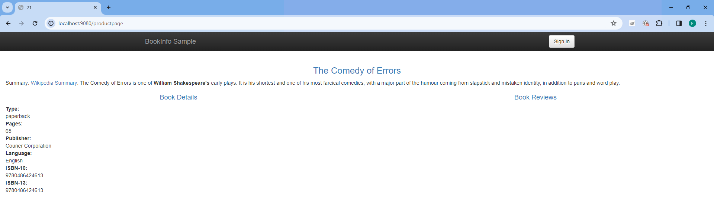

# Práctica Creativa 2 - 2023

El repositorio de esta práctica se encuentra alojado en el siguiente enlace: https://github.com/fercastell13/pc2-2023  
Autores: 
*Fernando Castell Miñón y Belén Casajús Casado*

## Descripción
En esta práctica se va a desplegar una aplicación (https://github.com/CDPS-ETSIT/practica_creativa2) utilizando diferentes tecnologías. 
Este documento, a la par que de memoria, sirve como guía para el correcto despliegue de la aplicación, con instrucciones detalladas sobre el uso de cada tecnología.

## Despliegue de una aplicación escalable

### 1. Despliegue de la aplicación en máquina virtual pesada (2 puntos)
En primer lugar se va a proceder al despliegue de manera tradicional: se va a desplegar la aplicación en una máquina virtual como un monolito. 
Esto se lleva a cabo con un script de python(*pc2.py*), que consta de tres partes: 
- La primera será la configuración inicial: clonado de la aplicación e instalación de las herramientas necesarias (git, pip y python)
- La segunda, la instalación de dependencias presentes en el archivo **requirementes.txt**
- Por último, se procede a cambiar la varibale de entorno **GRUPO_NUMERO** y a la ejecución de la aplicación en el puerto 9080 con la siguiente orden:
~~~
subprocess.check_call(["python3", "./practica_creativa2/bookinfo/src/productpage/productpage_monolith.py", str(puerto)])
~~~

El despliegue de esta aplicación se lleva a cabo en una máquina virtual de Google Cloud Platform. Por ello, a continucación se detallan los pasos a seguir para el correcto funcionamiento:
- Una vez dentro de GCP, creamos una nueva instancia de una máquina virtual con las siguientes especificaciones:
    - Como sistema operativo: Debian GNU/Linux 10
    - Permitir el tráfico HTTP y HTTPS
- A continuación, se abre una terminal y se procede al despliegue de la app de la siguiente manera:
~~~
sudo apt-get update
sudo apt-get -y install git
git clone https://github.com/fercastell13/pc2-2023.git
cd pc2-2023
python3 pc2.py
~~~

- Por último, hace falta crear una regla en el firewall de la máquina virtual. Para ello, se accede a "Detalles de Red" (VPC Network) -> Firewall -> Crear regla de Firewall y se le dan los siguientes valores:
    - Name: port-9080-allow
    - Red: valor por defecto
    - Prioridad: valor por defecto
    - Direction of traffic: Selecciona la dirección del tráfico (Ingress para tráfico entrante).
    - Acción: permitir
    - Targets: selecciona "Todas las instancias en la red
    - Source filter: 0.0.0.0/0
    - Protocolos y puertos: añadir un puerto TCP con valor 9080

Una vez hecho esto, la aplicación estará accesible a través del navegador con la siguiente orden:
~~~
http://<ip-publica>:<puerto>/productpage
~~~

### 2.- Despliegue de una aplicación monolítica usando docker (2 puntos)

La imagen creada con Dockerfile se encuentra disponible en DockerHub a través del siguiente enlace: 
https://hub.docker.com/repository/docker/fernandocastell/product-page

Se crea un archivo Dockerfile, abriendo el puerto 9080, haciendo el clonado de la aplicación, se instalan las dependencias necesarias con el fichero *requirements.txt*. 
Se crea la variable de entorno y se sustituye en el HTML.
Por último, se lanza la aplicación en el puerto 9080 con el siguiente comando:
~~~
CMD ["python3", "./practica_creativa2/bookinfo/src/productpage/productpage_monolith.py", "9080"]

~~~

Necesitamos iniciar el servicio de Docker. A través de la terminal sería:
~~~
sudo service docker start
~~~
En Windows:
~~~
Start-Service Docker
~~~

El proceso, por si no era lo suficientemente simple, se ha automatizado con el fichero *auto-docker.sh*, por lo que será suficiente un único paso:

Ejecutar auto-docker.sh:
~~~
./auto-docker.sh
~~~
Alternativamente, en windows:
~~~
.\auto-docker.sh
~~~

Ahora solo será necesario abrir el navegador:
~~~
http://localhost:9080/product-page
~~~

El resultado por pantalla será algo parecido a lo siguiente: 

### 3.- Segmentación de una aplicación monolítica en microservicios utilizando docker-compose ( 2 puntos)
//TODO

En esta versión se van a añadir dos servicios, Ratings y Reviews, y se van a separar los 4 servicios para que funcionen de forma independiente.

Para el despliegue en Docker Compose, se define la imagen con el Dockerfile de cada microservicio (para el Reviews viene ya definido). Con los ficheros necesarios explicados en la práctica, se crean las imágenes de cada servicio y con la siguiente orden se levanta el escenario:
~~~
docker-compose up
~~~

**Diferencias con la versión de un único contenedor.**

El desarrollo de una aplicación en un único contenedor supone una mayor simplicidad y facilidad de despligue, pues toda la lógica de la aplicación y sus dependencias están encapsuladas en un único entorno y esto facilita la gestión e implementación inicial.

Por otra parte, esto trae consigo limitaciones de escalabilidad.

En cambio, Docker Compose realiza la descomposición en microservicios, con cada servicio encapsulado en un contenedor individual. Estos permite tener una mejor escalabilidad, según sea necesario aumentar cierto tipo de microservicio.

Además, Docker Compose define las redes entre los contenedores y su arquitectura viene definida por el contenido del fichero *docker-compose.yaml* .

### 4.- Despliegue de una aplicación basada en microservicios utilizando Kubernetes (4 puntos)
//TODO
gcloud container clusters create pc2-cluster --num-nodes=5 --no-enable-autoscaling

//TODO - TEORÍA
**Diferencias al crear los pods, así mismo la diferencia que ve para escalar esta última solución.**

En Kubernetes cada microservicio se ejecuta en su propio pod, por lo que ya no hay un único contenedor que abarca toda la aplicación.

Cada microservicio puede escalarse de manera independiente según la demanda de recursos que sea necesaria, usando métricas (auto-scaling, por lo que no habría que preocuparse por la demanda). Además, Kubernetes incluye balanceadores de carga integrados, por lo que el tráfico se distribuirá automáticamente entre cada microservicio.

Para lanzar el escenario: 
~~~
minikube start
~~~

Puedes verificar el estado del clúster con el siguiente comando:
~~~
minikube status
~~~